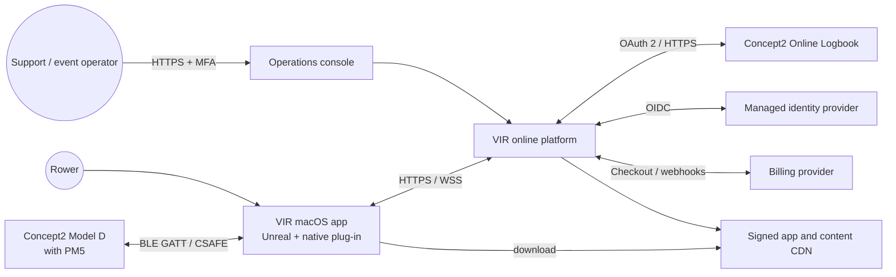
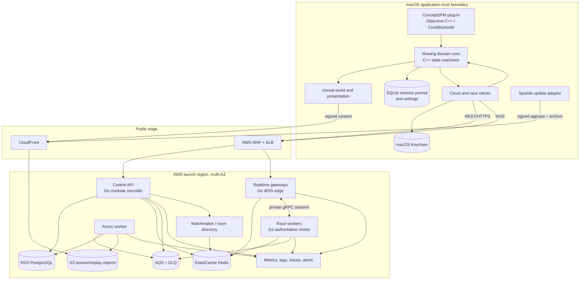
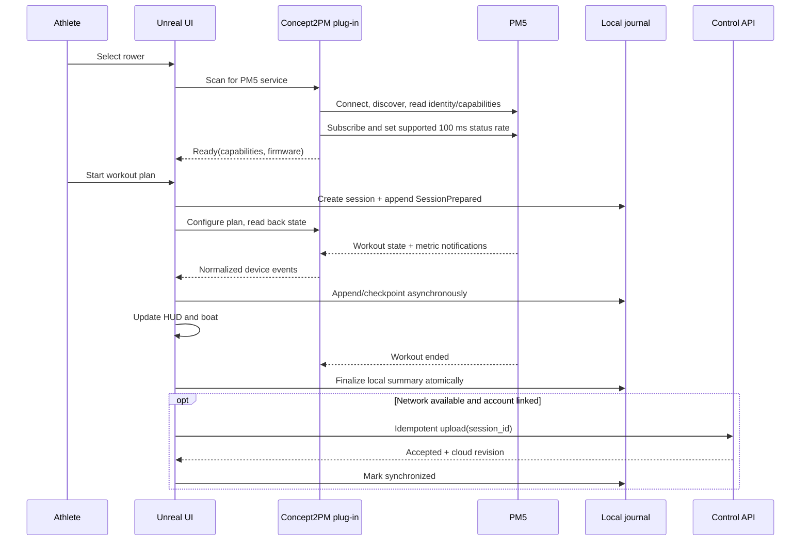
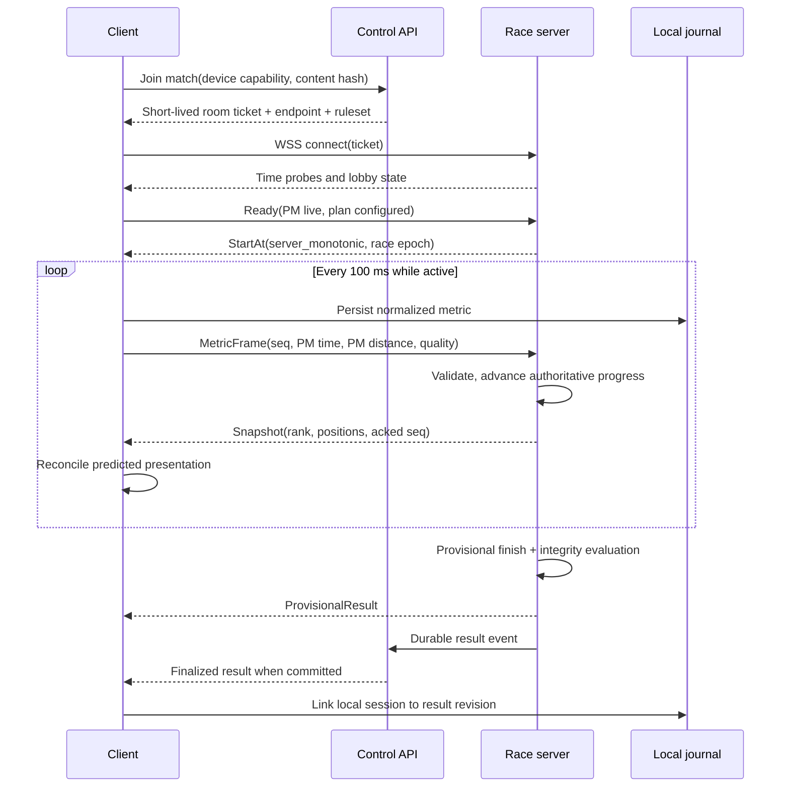

# System architecture

Status: Initial reference  
Owner: Architecture  
Last reviewed: 2026-09-13

## Executive design

VIR is an offline-capable Unreal application plus two cloud planes:

- The **macOS client** owns device acquisition, workout continuity, local prediction, rendering, and a durable local journal.
- The **control plane** owns identity mapping, catalog, durable workout summaries, social graph, entitlements, matchmaking, and integrations.
- The **real-time plane** owns ephemeral rooms, synchronized starts, authoritative distance/ranking, validation, and race snapshots.

The PM5, not Unreal physics and not the network, is the source of physical performance. The server is authoritative only over acceptance of those measurements and the competition derived from them.

## System context

The athlete can row locally when `Cloud`, `IdP`, `Billing`, or an external integration is unavailable. Only online-only journeys such as races and cross-device history are disabled.

## Container architecture

## Responsibility boundaries

| Concern | Authority | Reason |
|---|---|---|
| Raw device bytes and connection lifecycle | Concept2PM plug-in | Platform and protocol details do not leak into gameplay |
| Normalized rowing facts | Rowing domain core | One representation for local, online, tests, and replay |
| In-progress local workout | Local session journal | Network and rendering cannot make it disappear |
| Local boat presentation | Unreal client | Immediate feedback and smooth animation |
| Ranked progress and finish order | Race server | Common clock, rules, validation, and auditability |
| User/profile/session summaries | PostgreSQL through control API | Transactional, queryable durable state |
| Dense sample stream and replays | Compressed immutable object | Avoid unbounded time-series rows in primary database |
| Presence and room leases | Redis | Ephemeral state with TTL; never the only result store |
| Integration delivery | Worker + durable queue | Third-party slowness never blocks local completion |
| Entitlement | Control plane, cached locally | Provider webhooks are normalized; active workouts are insulated |
| Content compatibility | Signed manifest + route/ruleset hashes | Client/server agree on the experience without loading an Unreal map server-side |

## Sources of truth and consistency

There are four deliberately distinct kinds of truth:

1. **Measurement truth:** decoded PM5 cumulative values and state, with raw provenance and quality flags.
2. **Session truth:** the append-only local journal until cloud acknowledgement; cloud immutable sample object afterward.
3. **Competition truth:** the race server's accepted metric sequence, start time, ruleset, and finalization record.
4. **Presentation truth:** a reversible client estimate that may be corrected at any frame and is never persisted as an official result.

This prevents an attractive but incorrect client position from becoming a result. It also permits a valid workout to exist when a cloud race fails.

## Primary end-to-end flows

### Pair and complete a solo workout

### Join and finish a ranked race

## Component strategy

### macOS client

The active workout runtime is one signed application process; the updater's signed helper may run only outside a workout. CoreBluetooth runs on a dedicated serial dispatch queue, decoding and domain processing run off the Unreal game thread, and only immutable snapshots cross to rendering. This avoids premature device-helper/XPC complexity while isolating real-time device work from frame pacing. See [macOS and Unreal client](03-macos-unreal-client.md).

### Control-plane modular monolith

One Go deployable contains strongly separated modules for users, sessions, catalog, social, match orchestration, entitlements, and integrations. Modules own their tables and interact through interfaces or transactional domain events. A modular monolith is chosen until team or scale evidence warrants separate services; it preserves simple transactions and lower operational cost.

The worker is a separate process mode from the same repository and domain packages. It consumes durable jobs for sample compaction, FIT generation, Concept2 export, email, deletion, and analytics projection.

### Purpose-built race servers

A race process hosts many small rooms. Each room has a single-owner event loop and 20 Hz deterministic tick. It receives compact Protobuf metric frames over WSS, publishes 10 Hz snapshots, and produces a durable finalization event. Unreal dedicated servers are intentionally not used because course physics and rendering are not authoritative; the authoritative model is distance, timing, validation, and rank. See [ADR-0003](../adr/0003-authoritative-race-service.md).

### Storage

- **SQLite with WAL:** local session/event journal, downloaded metadata, outbox, and preferences that are not secrets.
- **Keychain:** refresh tokens and device-bound secrets. Access tokens remain in memory.
- **PostgreSQL:** accounts, summaries, interval aggregates, races, results, social data, entitlements, consent, and job idempotency.
- **S3:** compressed raw samples, replay/ghost artifacts, content packages, release artifacts, data exports, and backups.
- **Redis:** presence, room leases, match queues, rate-limit counters, and short caches. Every durable outcome is written elsewhere.
- **SQS/DLQ:** at-least-once asynchronous work; consumers are idempotent.

## Domain decomposition

| Domain | Main types | Emits |
|---|---|---|
| Device acquisition | `DeviceDescriptor`, `CapabilitySet`, `RawNotification`, `ConnectionState` | device status and raw facts |
| Telemetry | `MetricSample`, `StrokeEvent`, `DataQuality` | ordered normalized samples |
| Workout | `WorkoutPlan`, `WorkoutStep`, `Target`, `WorkoutState` | transitions, cues, summary inputs |
| Session | `Session`, `Interval`, `JournalEvent`, `SessionSummary` | durable completion/outbox item |
| Course | `RouteDefinition`, `CourseProgress`, `Checkpoint` | transform/routing inputs |
| Race | `RaceRuleset`, `MetricFrame`, `RaceSnapshot`, `Result` | result finalization |
| Identity/social | `User`, `Profile`, `Friendship`, `Presence` | privacy-filtered views |
| Commerce | `Product`, `Entitlement`, `Receipt` | access decisions |
| Integration | `Connection`, `ExportJob`, `DeliveryAttempt` | external delivery status |

Dependencies point toward these domain types. Platform APIs, Unreal types, SQL records, JSON payloads, and vendor SDK types are converted at adapters and never become domain contracts.

## Repository and code boundaries

### Unreal modules

- `RowingCore`: plain C++ domain types/state machines; no Slate, Actor, map, or CoreBluetooth imports.
- `RowingDevice`: transport-neutral interfaces and telemetry normalization.
- `Concept2PM`: macOS CoreBluetooth/Objective-C++ adapter plus CSAFE codec; plug-in with simulator transport.
- `WorkoutRuntime`: plan validation, cue scheduling, PM programming orchestration, summaries.
- `CourseRuntime`: distance-to-route mapping and local boat prediction.
- `RaceClient`: tickets, time sync, Protobuf framing, snapshots, reconciliation.
- `LocalData`: SQLite journal/outbox/migrations; asynchronous interfaces only.
- `OnlineClient`: account/control API, catalog, entitlement, integration status.
- `RowingUI`: CommonUI/UMG views and view models; no device parsing.
- `RowingWorld`: Actors, animation, VFX, audio, water, cameras, scalability.
- `Diagnostics`: structured logging, metrics, consented support bundle.

### Cloud packages

- `users`, `sessions`, `catalog`, `social`, `matches`, `results`, `entitlements`, `integrations`, `privacy`, and `admin` have explicit APIs and table ownership.
- Shared packages are limited to configuration, auth middleware, observability, database transaction primitives, and generated contracts.
- The race service imports only contracts, race rules, integrity rules, and infrastructure adapters. It cannot query profile or billing tables in the tick loop.

### Contract ownership

`Contracts/proto` is the canonical real-time and object-event schema. OpenAPI is generated/validated for control APIs. Generated code is committed or reproducibly generated under a pinned compiler. Backward compatibility is checked in CI.

## Failure behavior

| Failure | Required behavior |
|---|---|
| PM disconnect | Freeze authoritative local input, show prominent state, attempt bounded reconnect, journal gap; never synthesize meters |
| Renderer hitch | Device queue continues; game consumes latest snapshots and all durable stroke/session transitions |
| Client crash | Recover journal as `interrupted`; offer resume only if PM state and session identity can be safely reconciled |
| Internet loss in solo | Continue without degraded measurement; queue upload |
| Internet loss in ranked race | Predict briefly, reconnect with last ack/sequence, server decides grace; local workout still completes but result may be unranked |
| Control API unavailable | Cached entitlement within grace and downloaded solo content work; no new online match |
| Race process lost | Room lease expires, clients receive failure/retry; journaled metrics may yield an unranked workout, never fabricated race result |
| Redis lost | Presence/match queues rebuild; ongoing room process remains authoritative; durable results unaffected |
| PostgreSQL failover | APIs retry safe reads/idempotent commands; room continues and queues final result |
| Integration outage | Exponential retry with jitter and DLQ; local/cloud session remains complete |
| Bad content update | Manifest compatibility prevents activation; client retains last-known-good route and release channel can withdraw manifest |
| Clock change/sleep | Durations use monotonic and PM clocks; wall clock is metadata; sleep during active race causes explicit interruption |

## Capacity and evolution

Launch business targets are 10,000 registered users, 1,000 daily active users, and 250 concurrent online rowers. Initial room guardrails are 16 ranked rowers, 64 unranked group rowers, and 100 spectators; a client renders detailed transforms for only a bounded relevant subset. Infrastructure is tested against the larger planning envelope in the online/verification documents. These are planning figures, not hard-coded limits.

Scale in this order:

1. Increase stateless API/worker/race tasks horizontally.
2. Partition race rooms by process and region; use custom metrics for connected clients and tick saturation.
3. Add PostgreSQL read replicas for history/reporting and keep writes single-primary.
4. Project analytics from S3/event jobs instead of loading the transactional database.
5. Add a second race region when at least 10% of attempted races miss the RTT objective.
6. Split a control-plane module only when ownership, release cadence, or load isolation provides measurable value.

The system must not introduce Kafka, Kubernetes, a service mesh, or global active-active databases merely in anticipation of scale. Each requires a recorded trigger and a superseding architecture decision.

## Architectural fitness functions

CI or scheduled verification must continuously assert:

- Domain modules compile and test without Unreal Editor, CoreBluetooth, network, or database runtime.
- No secret-shaped value or raw PM serial appears in logs/telemetry fixtures.
- Protobuf and API changes remain backward compatible for the supported client window.
- Golden PM captures decode identically on every build.
- A killed client recovers a consistent session from every journal checkpoint boundary.
- A duplicate upload/finalization/integration job produces one logical outcome.
- A race replay produces the same accepted distances, penalties, finish order, and result hash.
- Packaged application passes `codesign`, Gatekeeper assessment, notarization, Bluetooth permission, update, and rollback tests.
- A representative route meets the thermal frame-time budget on the reference Mac.
