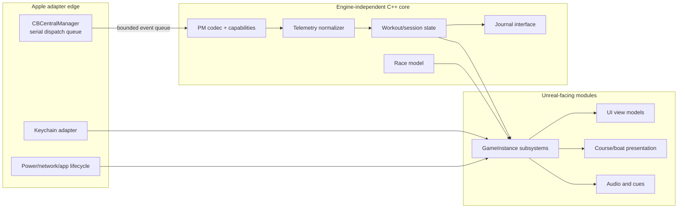
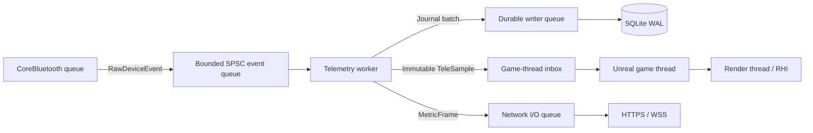
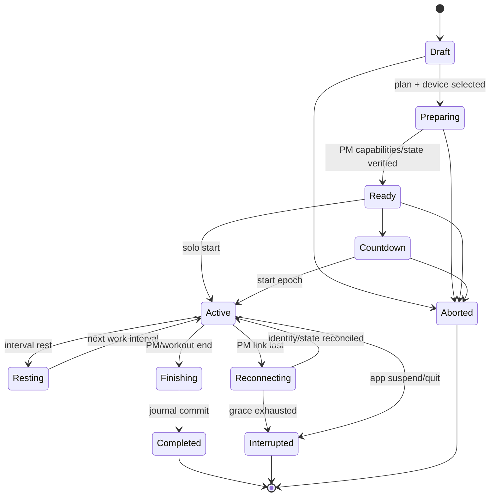

# macOS and Unreal client architecture

Status: Initial reference  
Owner: Client engineering  
Last reviewed: 2026-09-13

## Baseline

| Item | Decision |
|---|---|
| CPU architecture | Apple silicon `arm64` only at launch |
| Reference hardware | MacBook Pro, M5 Max, 128 GB unified memory |
| Runtime minimum | macOS Tahoe 26.6.2 |
| Engine | Unreal Engine 5.8, latest patch proven by the compatibility pipeline |
| Build toolchain | Xcode 26.1.1, pinned; do not allow CI auto-update |
| Renderer | Metal desktop deferred; 60 fps launch target |
| Primary language | C++20 as supported by the pinned UE toolchain; Objective-C++ only at Apple adapter edges |
| UI | CommonUI/UMG with C++ view models; keyboard/mouse first, gamepad optional |
| Local database | SQLite, WAL mode, encrypted secrets excluded |
| Distribution | Developer ID, Hardened Runtime, notarized DMG, signed Sparkle 2 update channel, introduced at Phase 4 (ADR-0008); Phase 0–3 builds are unsigned/ad-hoc |

Epic's UE 5.8 macOS matrix recommends Xcode 26.1.1 and explicitly calls Xcode 26.4 incompatible. Apple says Xcode 26.1.1 runs on Tahoe 26.x. This exact pairing remains pinned until a clean build, package, hardware loop, and soak test approves a replacement. See [platform research](../archive/research/2026-09-12-platform-and-unreal.md).

## Process and module model

The active workout runtime is a single application process. The device plug-in is isolated by interfaces and queues, not by an XPC helper. This gives Bluetooth permission prompts and lifecycle one owning application while avoiding an additional always-running signed process. Sparkle may launch its signed installer helper only while updating, and updates are forbidden during an active workout. A separate device process is reconsidered only if measured renderer crashes or Apple API constraints threaten workout durability.

### Dependency rules

- `RowingCore`, protocol codecs, workout rules, and race rules are standard C++ and must be testable without an Unreal world.
- Native Apple types end in the Objective-C++ adapter. Headers exposed to C++ contain opaque handles or domain values only.
- `UObject`, Actor, Slate, and UMG access occurs only on the game thread.
- Blueprints assemble visuals and authored cues; they do not decode sensors, calculate official metrics, mutate the journal, authorize access, or decide race results.
- Maps and assets reference stable data asset IDs. Business rules never identify an asset by a raw package path.
- The editor module validates route length, spline continuity, checkpoints, metadata hashes, performance budgets, and localization coverage before cooking.

## Runtime subsystems

| Subsystem | Lifetime | Responsibility |
|---|---|---|
| `UAppBootstrapSubsystem` | Game instance | boot gates, migrations, app lifecycle, safe mode, shutdown |
| `UDeviceSubsystem` | Game instance | scan/pair/reconnect UI state; transport-neutral device session |
| `UTelemetrySubsystem` | Game instance | immutable latest snapshot plus ordered stroke/state events |
| `UWorkoutSubsystem` | Game instance | workout plan, cue clock, session state, summary |
| `ULocalDataSubsystem` | Game instance | async journal, history queries, outbox, cache metadata |
| `UCourseSubsystem` | World | route mapping, local prediction, remote interpolation |
| `URaceSubsystem` | Game instance | ticket, time sync, race connection, authoritative snapshots |
| `UOnlineSubsystem` | Game instance | account/control API, entitlement, catalog, friends; not Epic OnlineSubsystem |
| `UContentSubsystem` | Game instance | signed manifest, installed versions, mount/activate/rollback |
| `UDiagnosticsSubsystem` | Game instance | redacted logs, local health counters, support export |

Unreal's `UGameInstanceSubsystem` and `UWorldSubsystem` names are implementation guidance; the domain interfaces remain stable if engine lifecycle details change.

## Thread and queue model

### Queue guarantees

- Connection, workout-state, stroke-boundary, interval-boundary, and completion events are non-coalescable.
- Periodic status samples are coalescable for rendering but not for the active journal or ranked network stream.
- The acquisition queue preserves producer order. It does not use priority reordering; capacity is reserved for critical events or split into ordered critical/sample lanes with an explicit deterministic merge rule.
- Each event has an adapter sequence, arrival monotonic timestamp, PM elapsed time when present, and quality flags.
- Queue capacity is fixed and instrumented. At 10 Hz a 512-event raw queue gives ample short-stall headroom.
- If a non-coalescable queue would overflow, the session is marked degraded and the failure is surfaced. The client never silently presents the session as verified.
- Database and network work never runs on the BLE queue or game thread.
- The app uses autorelease pools correctly on non-main Apple queues and copies byte payloads before delegate return.

## Boot sequence

1. Capture build/channel metadata and install crash handlers before loading a world.
2. Open SQLite, run forward-only transactional migrations, and verify the last checkpoint.
3. If the previous process ended during a session, create an explicit recovery candidate; never auto-merge with a new workout.
4. Verify installed content manifest/signatures and select the last-known-good compatible content set.
5. Load preferences and accessibility settings; fetch Keychain credentials asynchronously.
6. Present the usable local menu. Cloud sign-in, catalog refresh, update check, and friend presence continue in the background.
7. Start Bluetooth scanning only after a clear user action so the permission request has context.

A cloud timeout may alter online tiles but must not delay the local menu. A failed content verification enters safe mode with a minimal cooked training environment.

## Session lifecycle

Every transition appends a journal event before it is exposed to UI. A terminal disposition is not shown as finalized until the database writer acknowledges its commit. A process crash cannot reliably append a fatal-error transition; on the next boot, recovery detects the open journal, appends a recovery event, and derives an explicit `Interrupted` disposition. `Completed`, `Interrupted`, and `Aborted` remain distinct.

## Local persistence

The database lives under the application's Application Support container and uses WAL plus `synchronous=NORMAL` for ordinary samples. Completion and final summary use an explicit transaction followed by a durability barrier, and the UI waits for its acknowledgement before claiming finalization. QA-003's one-second bound applies to process termination after the last acknowledged checkpoint. Sudden power loss, storage-controller failure, and filesystem damage are separate fault classes with measured recovery behavior; the product does not promise they are equivalent to a process crash. The write path is benchmarked before changing to `FULL` during active sessions.

Minimum local tables:

- `schema_migrations(version, checksum, applied_at)`
- `sessions(session_id, user_scope, plan_id, route_id, state, started_at_utc, timezone, source, content_hash, created_at)`
- `journal_events(session_id, sequence, monotonic_ns, kind, payload_version, payload_blob)`
- `sample_chunks(session_id, first_sequence, last_sequence, codec, crc32c, payload_blob)`
- `session_summaries(session_id, revision, metrics_blob, quality_flags, finalized_at)`
- `sync_outbox(operation_id, aggregate_id, kind, attempt, next_attempt_at, payload_hash)`
- `cloud_links(session_id, cloud_id, cloud_revision, acknowledged_at)`
- `installed_content(content_id, version, manifest_hash, status, last_verified_at)`
- `paired_devices(local_device_id, display_label, capability_cache, last_seen_at)`

Raw OAuth tokens and raw PM serial numbers do not belong in SQLite. The macOS CoreBluetooth peripheral identifier is local-only. A raw serial is held only as long as needed for connection confirmation and optional server pseudonymization; it is never written to ordinary logs.

Before multi-user or release scope, fitness summary payloads and compressed sample chunks use AES-256-GCM with a per-local-profile Keychain data key. Nonces are unique and the session/chunk identity is authenticated associated data. Use Apple's reviewed cryptographic APIs behind a native adapter—never a custom cipher. The database and WAL also use owner-only filesystem permissions; FileVault remains valuable for whole-device protection.

For development and single-user scope, [ADR-0012](../adr/0012-plaintext-development-single-user-journals.md) supersedes that encryption requirement with owner-only plaintext SQLite/WAL journals. It does not relax durability, privacy handling, or the requirement to restore encryption before multi-user or release scope.

Sample events are batched into independently checksummed chunks, normally one second each. This keeps append overhead bounded and makes corruption local rather than invalidating a whole session. A recovery scan accepts complete chunks, truncates only an incomplete tail, recomputes the provisional summary, and sets `recovered_after_unclean_exit`.

## Telemetry consumption and presentation

The PM cumulative distance is the canonical progress input. The client keeps these separate:

- `measured_distance`: last accepted normalized PM value.
- `predicted_distance`: short extrapolation using filtered current speed, capped to 250 ms.
- `presented_distance`: critically damped convergence toward prediction or server snapshot.

The course maps distance to an authored spline and lane offset. Collision, wake, wave, and camera movement are cosmetic and cannot add official meters. Remote boats render from a 200–300 ms interpolation buffer; missing snapshots extrapolate for at most 500 ms and then visibly coast/fade rather than teleport indefinitely.

Avatar stroke phase follows PM stroke state/stroke boundaries when available. It blends between authored catch, drive, finish, and recovery poses. Stroke rate alone is a fallback with a quality marker, not the primary animation signal.

## Workout runtime

`WorkoutPlan` is a versioned domain object, not a Blueprint graph. It contains ordered work/rest steps with one duration dimension (time, distance, calories, or watt-minutes where supported), optional targets, repetition structure, and cue policy.

Before the session:

1. Validate plan limits against the PM firmware capability profile.
2. Compile supported steps to documented CSAFE commands.
3. Program the PM as a transaction-like state machine with timeouts and retries.
4. Read back workout type/duration/state and show Ready only after verification.
5. If the plan cannot be represented safely, use an explicitly labeled app-guided Just Row mode or reject it; never partially program it without disclosure.

The PM and the app both track intervals. The saved record preserves PM facts and app plan facts separately so discrepancies are diagnosable.

## Rendering architecture and content budgets

The reference Mac is powerful, but the shipping baseline avoids preview/beta rendering features as hard dependencies:

- Metal desktop deferred shading.
- Conventional LOD/HLOD and tested shadow maps as the guaranteed baseline.
- Lumen software ray tracing may be a High/Epic option after thermal validation.
- Hardware ray tracing and MegaLights are not launch dependencies on macOS.
- Nanite assets require production fallback meshes and a non-Nanite path because Epic describes macOS Nanite/VSM support as beta.
- TSR/dynamic resolution may scale internal resolution, with a default lower bound established by HUD legibility tests.
- Water uses bounded screen-space/mesh simulation; no gameplay decision reads render water physics.
- Niagara particle counts, translucent overdraw, skeletal meshes, texture pools, draw calls, and shader permutations have per-route budgets enforced by the editor validator.

Frame budget at 60 fps (GPU revised by [ADR-0013](../adr/0013-increase-reference-gpu-frame-budget.md)):

| Work | Budget |
|---|---:|
| Game thread | 4.0 ms p95 |
| Render thread | 5.0 ms p95 |
| GPU | 16.5 ms p95 |
| Device decode + domain update | 0.5 ms per 100 ms telemetry cycle |
| HUD update | 0.5 ms per frame; values need not invalidate layout every frame |

GPU and CPU budgets overlap; they are not meant to sum to frame time. Performance is captured with Unreal Insights and Metal tooling on cold, warm, and 60-minute thermal runs.

## Route contract

Each cooked route has a generated `RouteDefinition` containing:

- stable route ID and semantic version;
- display/localization keys and preview asset IDs;
- centerline length in millimeters and closed/open flag;
- checkpoint distances and finish distance;
- spline arc-length lookup hash;
- lane layout and maximum visible population;
- minimum client/content/ruleset compatibility;
- performance-budget report and package hashes.

The route validator rejects non-monotonic arc length, gaps, ambiguous intersections, finish mismatch, missing safe spawn, and out-of-budget content. Online participants may render different approved cosmetic quality levels, but must use the same route definition hash and race ruleset hash.

## UI under exertion

- Primary metrics use stable positions, tabular numerals, and a minimum size tested at the physical viewing distance.
- No essential action relies only on a small pointer target, color, or hover.
- A disconnect, pause, rest, countdown, or unsafe version state receives both visual and optional audible feedback.
- Menus support keyboard focus order and Escape/back consistently.
- Reduce-motion mode limits camera bob, FOV pulses, particles, and rapid HUD transitions.
- Competitive cues cannot be disabled in a way that conceals start/penalty state, but equivalent accessible cues are provided.
- The app never opens account/payment web content during an active workout.

## macOS lifecycle and packaging

- Add a clear `NSBluetoothAlwaysUsageDescription` to the packaged app and test the first permission denial/recovery path.
- Direct launch distribution does not enable App Sandbox initially. If Mac App Store distribution is added, enable Bluetooth, network-client, and only the minimum required sandbox entitlements in a separately tested target.
- Hardened Runtime and library validation remain enabled. Exceptions need a threat-model review.
- Respond to termination, logout, and system sleep by checkpointing and marking an active session interrupted. Do not claim successful completion because `applicationWillTerminate` is not guaranteed.
- Keep the machine awake only while a workout is active and with a visible reason; release the power assertion immediately afterward.
- Sparkle checks are idle/menu only. An update can download during idle but cannot install while a workout, race lobby, or unsynchronized recovery is active.

## Client observability

Structured local events include build/content/contract versions, anonymized device class, firmware/hardware version, state transitions, latency histograms, queue depths, frame statistics, network quality, and categorized errors. They exclude raw PM serial, access/refresh tokens, email, free text, and high-frequency heart-rate samples.

The user can preview and explicitly export a support bundle containing:

- a redacted rolling log;
- app/OS/hardware and content versions;
- PM model/firmware and hashed device pseudonym;
- state-transition timeline and error codes;
- aggregate queue/frame/network metrics;
- optional selected session metadata, off by default.

Telemetry upload and product analytics are separately consented/configured from a user-initiated support export.
