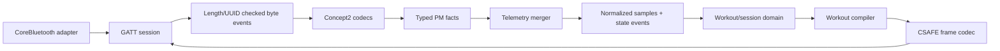
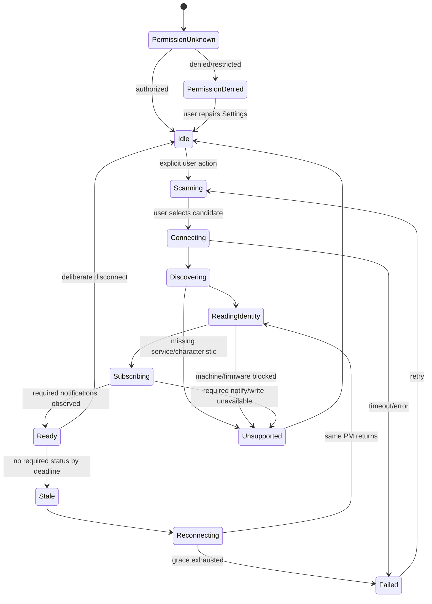

# Concept2 Model D / PM5 integration

Status: Initial reference  
Owner: Device engineering  
Last reviewed: 2026-09-12

## Hardware boundary

Software integrates with the **Performance Monitor**, not directly with the Model D flywheel. Launch support means:

- Concept2 Model D (or mechanically equivalent rower only when later approved);
- PM5 monitor configured for a D/E/RowErg machine type;
- firmware in the signed support matrix, normally the latest production release;
- Bluetooth enabled and the user on the PM's Connect screen as required;
- no other fitness app connected to the PM during the VIR session.

Model D machines may have PM3, PM4, or PM5 monitors depending on age. PM5 has been standard on Model D units from October 2014 and can be retrofitted to older machines. A Model D label therefore does not imply BLE compatibility. The pairing screen must show how to identify the monitor and link to the supported retrofit/firmware guidance.

## Launch transport decision

Bluetooth Low Energy through Apple's CoreBluetooth framework is the only launch transport. USB is an interface seam and lab fallback, not a product promise. This avoids requiring a USB-B-to-C cable at the rower and avoids basing the product on Concept2's explicitly outdated macOS SDK.

Concept2's current communication definition documents USB, BLE, and RS485 transports and supplies a BLE GATT interface. The implementation is clean-room against that published specification; old SDK binaries or source are not linked. Production use, brand references, protocol questions, and any access to non-public authentication material must be agreed with Concept2.

See [Concept2 research](../archive/research/2026-09-12-concept2-pm5.md) and [ADR-0002](../adr/0002-pm5-ble-integration.md).

## Layering



The layers have separate test suites:

- **Transport:** discovery, lifecycle, CoreBluetooth callback ordering, permissions.
- **GATT:** service/characteristic discovery, subscription, notification routing, writes.
- **Codec:** byte length, little-endian fields, enumerations, scale, checksums, frame stuffing.
- **Merger:** characteristics with different timestamps become a coherent sample without manufacturing values.
- **Domain:** device-independent workouts and session state.
- **Command compiler:** plan constraints to a documented sequence with readback verification.

## Published BLE surface used at launch

Concept2 uses base UUID `CE06XXXX-43E5-11E4-916C-0800200C9A66`. UUIDs and byte layouts are generated into constants from a reviewed protocol manifest rather than repeated as magic values throughout code.

| Short ID | Role | Launch use |
|---|---|---|
| `0x0010` | Concept2 device-information service | discover PM identity/capabilities |
| `0x0011`–`0x0018` | model, serial, hardware, firmware, manufacturer, machine type, MTU/DLE | capability handshake; raw serial remains local |
| `0x0020` | PM control service | managed-workout CSAFE command/response |
| `0x0021` | command receive characteristic | bounded CSAFE write |
| `0x0022` | response transmit characteristic | CSAFE response/read according to supported firmware behavior |
| `0x0030` | rowing service | telemetry discovery root |
| `0x0031` | general status | elapsed time, distance, workout/rowing/stroke states, drag factor |
| `0x0032` | additional status 1 | speed, stroke rate, optional heart rate, current/average pace, rest values |
| `0x0033` | additional status 2 | interval count, average power/calories, split values |
| `0x0034` | general/additional status sample rate | request `3` (100 ms) only after capability check |
| `0x0035` | stroke data | drive/recovery timing, force summaries, work/stroke, stroke count |
| `0x0036` | additional stroke data | stroke power, calories, projected work |
| `0x0037`, `0x0038`, `0x0042` | split/interval data | interval finalization when supported |
| `0x003D` | force curve | deferred feature; subscribe only in a dedicated capability-gated mode |
| `0x003E` | additional status 3 | operational/verification/error state and battery where firmware supports it |
| `0x003F` | logged workout | optional final cross-check, not required for session durability |

Only characteristics required by the current mode are subscribed. Unknown characteristics are logged by ID/length without their payload and ignored. New firmware does not become supported merely because discovery succeeds.

## Connection state machine



### Discovery and selection

- Scan for the Concept2 service UUID, not every nearby BLE advertisement indefinitely.
- Never auto-connect to a new machine just because its RSSI is strongest.
- Show a stable friendly suffix and signal strength; do not display/store raw serial in analytics.
- Remember a selected peripheral identifier locally. Auto-reconnect only that explicit selection within a user-started session.
- Stop scanning after selection or timeout to limit interference and energy use.

### Readiness handshake

`Ready` requires all of the following:

1. CoreBluetooth reports a connected peripheral.
2. Required services and characteristics exist with expected properties.
3. Model, hardware version, firmware version, and connected erg machine type are read and parse correctly.
4. The signed capability matrix accepts that tuple and identifies it as an indoor rower.
5. Required notifications are enabled.
6. The requested sample rate is written/read when supported.
7. At least one structurally valid general status and status-1 notification arrives.
8. PM workout/operational state is compatible with the requested action.

Advertising, connecting, or discovering a service alone never means the device is workout-ready.

## Capability matrix

Firmware variants expose different characteristics and valid layouts. Maintain a data-driven matrix delivered with the client and optionally tightened by a signed remote compatibility rule:

```text
CapabilityProfile
  monitor_model_pattern
  hardware_revision_range
  firmware_version_range
  machine_types
  required_characteristics
  optional_characteristics
  notification_lengths_by_characteristic
  control_protocol_mode
  supported_workout_features
  known_issues
  support_state: allowed | warn | blocked
```

A remote rule may block a known-dangerous version or display a warning. It may not enable parsing code or a new wire layout that is absent from the signed client. The local bundled matrix is sufficient for offline use.

## Byte decoding rules

- Validate characteristic UUID and exact allowed length before field access.
- Decode multi-byte values explicitly from little-endian bytes; never cast an unaligned byte buffer to a struct.
- Convert at the adapter boundary to fixed-scale SI values defined in [data and protocols](06-data-and-protocols.md).
- Preserve the raw source resolution and `source_characteristic` for audit.
- Treat documented sentinels such as heart rate `255` as unavailable, never as a real value.
- Validate every enumeration; preserve an unknown numeric value for diagnostics while mapping it to `Unknown` in the domain.
- Reject non-finite or physically impossible derived values. Do not clamp them into apparently valid competition data.
- Use PM elapsed time to join notifications. Arrival time breaks ties and measures transport latency.
- Detect PM timer/distance reset from workout-state transitions. Do not interpret an ordinary reset as a 24-bit rollover.
- A source time regression, sequence discontinuity, duplicate, reset, or notification-length change sets a quality flag and generates a state event.

## Normalized data

The merger publishes an immutable `MetricSample` at the best supported cadence, normally 10 Hz:

| Field | Primary PM source | Rule |
|---|---|---|
| PM elapsed ms | general/status notification | required while active |
| cumulative distance mm | general status | required and monotonic within active segment |
| speed mm/s | additional status 1 | nullable; no local differentiation of distance unless degraded/unranked |
| current pace ms/500 m | additional status 1 | nullable/sentinel-aware |
| stroke rate deci-spm | additional status 1 | integer source converted to fixed scale |
| stroke state | general status | unknown preserved |
| workout/rowing state | general status | drives lifecycle with debounce rules |
| stroke power W | additional stroke data | stroke event value, not falsely treated as continuous 10 Hz power |
| average power W | additional status 2 | aggregate |
| heart rate bpm | additional status 1 | nullable and privacy-controlled |
| drag factor | general status | nullable |
| stroke count | stroke data | monotonic cross-check |
| interval data | split characteristics | finalized aggregate/events |
| data quality | adapter/merger | bit set plus diagnostic detail event |

Notifications for the same PM timestamp can arrive in either order. Hold an incomplete merge bucket for a small fixed window (initially 30 ms), then publish with absent fields marked null. Late information emits a typed correction tied to sample sequence; rendering may use it, while persistence retains a deterministic merge rule.

## CSAFE control policy

The PM protocol contains public and Concept2 proprietary command modes and warns that they must not be mixed. VIR applies these rules:

- Passive telemetry subscriptions do not trigger control commands.
- A managed workout selects one documented control mode for the whole PM control session.
- Launch managed workouts use documented Concept2 proprietary CSAFE over BLE only where the capability profile explicitly permits it.
- No undocumented command, authentication secret, firmware update, memory mutation, or monitor conversion is attempted.
- A command builder bounds the unstuffed/stuffed frame, applies checksum and byte stuffing, and enforces the documented maximum frame size.
- Exactly one command transaction is in flight per PM. Each has command ID, expected response shape, timeout, retry safety classification, and correlation event.
- Configuration commands are not blindly retried. On timeout, read state first; then either continue, compensate/terminate safely, or ask the user to reset.
- Workout compilation enforces PM parameter limits before sending anything.
- Readback of workout type, duration, intervals, and Prepare-to-Row state is required before readiness.

The app-guided fallback does not pretend the PM was programmed. It instructs the user to start Just Row, records the PM workout, and applies plan cues locally. Ranked event rules can disallow this fallback.

## Disconnect, reconnect, and stale data

The UI marks live metrics stale when no required general status arrives for 500 ms at the 100 ms rate. After 1.5 s it shows a blocking device warning; thresholds are tuned by hardware tests.

During reconnect:

- Official distance and workout targets freeze at the last PM fact.
- The visual boat may coast cosmetically for at most 500 ms, then stops/fades.
- The journal records link loss, last source timestamp, and every reconnect attempt.
- Reconnection is limited to the same locally selected peripheral.
- Identity, firmware, machine type, current PM workout state, elapsed time, distance, and stroke count are read/reobserved.
- Continuation requires monotonic values and a compatible workout identity/state. Otherwise the original session becomes interrupted and a new one requires user action.

For a ranked race, the race ruleset defines a shorter server grace and whether a reconciled distance gap is accepted, capped, or sent to review. Local workout preservation and competitive acceptance are separate decisions.

## Fair-play limits of BLE

Ordinary PM5 BLE is a data link, not remote attestation. A modified client can forge frames after receipt, and a software peripheral may imitate advertised services. Therefore:

- “Supported device” means the live protocol passed the capability/state checks; it does not mean cryptographic proof of hardware.
- Ranked validation uses consistency, timing, distance/power/stroke relationships, continuity, version/risk signals, and replay review.
- High-stakes or prize events require a separate certified-event design, such as supervised stations, wired venue racing, signed official builds, video/officials, and Concept2 coordination.
- Never publish an unqualified “cheat-proof” or “hardware verified” claim.

## Heart-rate behavior

At launch, VIR consumes the heart rate already reported by the PM5; it does not independently pair a heart-rate strap. This avoids two apps competing for the strap and preserves PM provenance.

- Missing/`255` is displayed as unavailable.
- Heart-rate recording and cloud synchronization are an explicit user setting with clear purpose.
- Disabling storage does not break the workout. The transient value may be displayed if the user requested the HUD, then discarded.
- Heart rate never determines official race distance or finish order.

## Diagnostics and privacy

Normal production logs record UUID short ID, expected/actual length, parser result, state, timings, and categorical error—not raw notification payloads. A time-limited raw capture can be enabled only through a user-consented diagnostic mode; it is visibly active, stored locally, and scrubbed before support export.

The raw PM serial is held locally only for showing/confirming the current device and for an optional pseudonymization exchange; it is not persisted in SQLite or ordinary logs. When server-side correlation is enabled for a stated integrity/support purpose, the client sends the normalized serial and hardware revision over authenticated TLS to a narrow service that immediately computes `HMAC-SHA-256(environment_pepper, normalized_serial + hardware_revision)`. The service must neither persist nor log its raw input; its pepper is KMS-protected and is not shipped in the client. The resulting pseudonym is purpose-restricted and environment-specific. Until that exchange, use only a random local device ID.

## Required test assets

- At least one Model D with each supported PM5 hardware generation.
- Latest production firmware plus the oldest allowed and one explicitly blocked version per generation.
- BLE interference rig and controlled distance/RSSI test positions.
- USB cable/Concept2 Utility available only for lab firmware recovery and comparison.
- Sanitized notification captures for idle, Just Row, fixed time/distance, interval/rest, pause, finish, reset, low battery, malformed payload, disconnect, and reconnect.
- A PM5 simulator that reproduces callback ordering, timing jitter, duplicates, gaps, resets, unknown fields, and changed lengths.
- A physical reference comparison: PM display, local summary, cloud summary, and Concept2 Logbook result agree within documented resolution.

No firmware tuple enters the allowed matrix until it passes the hardware-in-loop suite and a minimum 60-minute soak.
