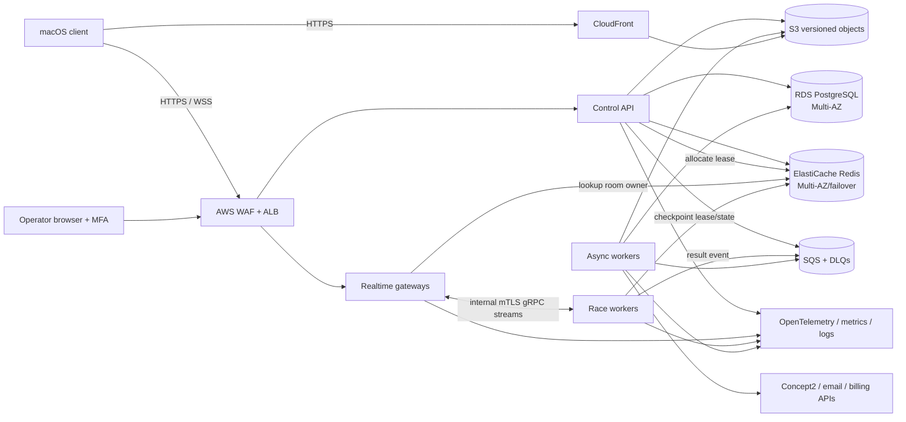

# Online platform and real-time racing

Status: Initial reference  
Owner: Online engineering  
Last reviewed: 2026-09-12

## Goals

The cloud adds identity, synchronization, social presence, subscriptions, content discovery, integrations, and competition. It does not sit between the PM5 and the local workout record. Online services are designed so a cloud incident cannot corrupt or erase an athlete's local session.

Launch in one AWS region (`ap-northeast-2`, Seoul) across at least two availability zones. The region is a deployment default, not a promise that every global athlete has race-grade latency. Add a second race region only after demand and synthetic probes justify it; account/session data stays in the designated home region until a reviewed multi-region data design exists.

## Deployable units

| Unit | Technology | Responsibility | Scaling signal |
|---|---|---|---|
| Control API | Go on ECS Fargate | public REST, authorization, catalog, sessions, social, entitlements, matchmaking/admin orchestration | request concurrency, CPU, latency |
| Realtime gateway | Go on ECS Fargate | WSS termination after ALB, room ticket validation, heartbeats, connection quotas, routing to owner worker | active connections, ingress/egress |
| Race worker | Go on ECS Fargate initially | single-owner room loops, 20 Hz rules, validation, snapshots, provisional result | active rooms, tick time, CPU |
| Async worker | Go on ECS Fargate | upload verification, projections, FIT, external exports, privacy jobs, email | SQS age/depth |
| Operator web | static web + control API | support/event operations through RBAC APIs | ordinary web demand |

The gateway and race worker can share one repository and container image with different process modes. They remain separate services so long-lived public sockets do not dictate room CPU placement. At sustained scale or when p99 tick deadlines fail under Fargate scheduling, move race workers—not the API—to ECS on dedicated Graviton instances. Do not introduce Kubernetes solely in anticipation.

## Cloud topology

All workloads run in private subnets. Only CloudFront and ALB are public. NAT egress is allow-listed/observed where practical. Databases, queues, and object storage are reached through private networking/endpoints. Infrastructure is Terraform with separate accounts for production and non-production.

## Identity and authorization

Use a managed OIDC provider, initially Amazon Cognito User Pools, behind a small `IdentityProvider` client/server interface. The macOS app uses Authorization Code with PKCE through the system browser and a claimed HTTPS/universal-link callback where supported. It never embeds a client secret or collects an identity-provider password.

- Access token: short-lived and memory-only.
- Refresh token: macOS Keychain with an access-control policy appropriate to the app.
- Race ticket: audience-bound, room-bound, participant-role-bound, single-use identifier, and ≤2-minute initial validity.
- Service identity: AWS task role plus mutually authenticated internal transport for gateway/worker calls.
- Operator identity: separate group/role claims, phishing-resistant MFA, short session, and step-up for destructive actions.
- Guest mode: random local identity only; no multiplayer/leaderboard. Account creation adopts local sessions through an explicit, idempotent claim flow.

Sign in with Apple can federate into the managed identity service. The backend validates issuer, audience, signature, nonce, and token time. Account linking requires a fresh authentication ceremony and never matches accounts only by display name.

Authorization is policy-based at the API boundary and rechecked in domain operations. Knowing a UUID is never authorization. User-facing IDs are random UUIDv7/ULID-style opaque identifiers, not database sequence IDs.

## Control API

Public API prefix is `/v1`; breaking changes use a new major prefix. OpenAPI is canonical for request/response shape and generated clients. Important resources include:

| Resource | Representative operations |
|---|---|
| `/me` | get/update profile, privacy and units |
| `/me/consents` | record/revoke versioned purpose consent |
| `/me/sessions` | create/idempotent finalize/list/detail/delete visibility |
| `/me/session-uploads` | request object upload, complete with digest, observe processing |
| `/me/integrations` | begin OAuth link, callback status, disconnect, per-session export status |
| `/catalog` | compatible routes, plans, content manifests, announcements |
| `/friends` | request/accept/remove/list with privacy filtering |
| `/presence` | coarse online/joinable state, never a raw socket directory |
| `/events` | list/details/register/cancel |
| `/matches` | create private room, join code, enter queue, poll/receive allocation |
| `/entitlements` | current normalized access and offline-cache envelope |
| `/exports` | request/download account data export |
| `/account-deletion` | schedule/cancel/observe deletion |
| `/admin/*` | audited, role-protected support/event actions only |

Every unsafe request accepts an `Idempotency-Key`. The server stores request digest, status, and response under the authenticated principal. Reusing a key with a different digest is an error. Optimistic concurrency uses resource revisions/ETags where users can edit the same data from different clients.

## Control-plane domain modules

The initial control API is a modular monolith, with one logical PostgreSQL database and schema/table ownership:

- **Accounts:** internal user ID, IdP subjects, profile, locale, privacy.
- **Consent/privacy:** terms versions, purposes, export/deletion workflow.
- **Sessions:** metadata, summaries, interval projections, sample-object pointer, quality.
- **Catalog/content:** route/plan metadata, versions, compatibility, rollout.
- **Social/presence:** relationships, blocks, coarse presence policy.
- **Events/matches:** schedules, registrations, lobby policy, room allocation.
- **Results/leaderboards:** immutable result revisions and eligibility views.
- **Entitlements:** provider-independent products, grants, grace, webhook ledger.
- **Integrations:** encrypted token references, requested scopes, delivery jobs/status.
- **Operations:** support cases, feature flags, sanctions, audit events.

Modules call explicit interfaces. Cross-module state changes use a transactional outbox in the same PostgreSQL commit. An outbox relay publishes jobs to SQS; consumers deduplicate by event ID.

## Session synchronization

The local client remains authoritative for an ordinary completed workout until the server acknowledges it.

1. Client creates or resumes `session_id` locally.
2. On completion it commits summary, interval aggregates, quality flags, and a deterministic digest of sample chunks.
3. Client sends idempotent session metadata/summary.
4. API returns a presigned, narrowly scoped S3 upload for a compressed Protobuf session object if samples are enabled for sync.
5. Client uploads and reports size, SHA-256 digest, codec, and schema version.
6. Worker streams the object, enforces size/shape limits, verifies the digest and internal chunk checksums, and builds trusted server projections.
7. Server sets `processing`, then `accepted`, `accepted_with_warnings`, or `rejected`; acknowledgement includes a revision.
8. Client records the cloud link/ack but retains the local record according to user retention settings.

Duplicate calls or worker deliveries converge on one session/revision. Object keys are server-generated and cannot escape the authenticated user's prefix. Uploaded bytes are never executed or interpreted as Unreal assets.

For a ranked race, the race worker's accepted metric log and result record take precedence for rank. The later local session upload is reconciled by session ID, PM times, sequences, summary, and digest. A mismatch changes integrity status; it does not silently rewrite the race record.

## Matchmaking and room allocation

Match inputs include mode, distance/ruleset, ability/rating band if applicable, region latency sample, party, block list, device capability, content version, and integrity eligibility.

1. Control API validates entitlement, registration, sanctions, content/ruleset compatibility, and a recent live-device preflight.
2. Matchmaker forms a lobby or resolves a join code.
3. It allocates the least-loaded healthy race worker and creates a TTL room lease in Redis using compare-and-set semantics.
4. It returns gateway endpoint, short-lived signed ticket, room ID, content/ruleset hashes, and join deadline.
5. Any gateway validates the ticket, looks up the owner lease, and opens/reuses a private gRPC stream to that worker.
6. Worker admits the participant exactly once by ticket ID and role.

Initial guardrails are 16 active rowers in a ranked room, 64 in an unranked group row, and 100 spectators. A client receives full rank summaries but detailed transforms only for the nearest/most relevant bounded set (initially 24). Limits are configuration constrained by load evidence, not marketing constants.

## Real-time protocol

Use binary Protobuf messages over TLS WebSocket (`wss` on 443). Rowing updates are small and at most 10 Hz, so WebSocket interoperability and operational simplicity outweigh QUIC complexity at launch. The protocol still uses latest-state semantics so a future transport can avoid head-of-line blocking.

### Connection phases

`Connect → AuthenticateTicket → TimeSync → Lobby → Ready → Countdown → Active → Finishing → Result → Close`

Messages legal in each phase are allow-listed. Rate/size limits are phase-specific. A heartbeat is exchanged every 5 seconds when no other traffic exists.

### Time synchronization

- Gateway/worker clocks use chrony/NTP and expose health offset.
- Client performs multiple ping/pong probes and estimates offset using the lowest-delay samples.
- The owning worker sends its monotonic start deadline plus a UTC audit anchor; client schedules against local monotonic time using the worker-offset estimate. Time probes are proxied to that owner, not answered by an unrelated gateway clock.
- Client display may count down locally, but the server judges early/late metric evidence against its start epoch and ruleset.
- A client whose uncertainty exceeds the ruleset threshold is warned or made unranked before start.

### Metric ingestion

Client sends a `MetricFrame` every 100 ms while active, plus immediate non-coalescable state/stroke events. Frames contain sequence, local session ID, PM elapsed/distance, normalized optional metrics, source quality, and previous-frame chain digest. They do not contain an avatar transform.

Race worker checks:

- ticket/connection/participant state;
- schema and bounded message size;
- strictly advancing sequence with duplicate idempotence;
- PM elapsed and distance monotonicity under explicit reset/gap rules;
- allowable clock skew, cadence, gaps, and reconnect window;
- plausible distance/speed/power/stroke relationships using broad published/product thresholds;
- consistency with content/ruleset, workout state, start epoch, and prior frames;
- risk policy and supported-client/firmware constraints.

Rejected data receives a reason and last accepted sequence. Accepted progress is the cumulative accepted PM distance relative to the server-observed race baseline. It is not derived from client-reported position and does not grant ranked drafting boosts.

### Tick and snapshots

- Each room is owned by one goroutine/event loop; no locks are used inside room rules.
- A monotonic 20 Hz tick processes queued inputs and race transitions in deterministic participant order.
- A 10 Hz `RaceSnapshot` includes snapshot sequence, server time, acked input per recipient, authoritative progress/rank/status, and nearby participant state.
- Clients interpolate remote movement and reconcile local presentation; they do not roll back the physical workout.
- Critical transitions (start, penalty, finish, cancellation) are reliable application messages with IDs and acknowledgements, not inferred only from a snapshot.

## Room recovery

The worker writes a bounded room checkpoint to Redis at least once per second: ruleset/content hashes, phase/epoch, participants, last accepted sequence/progress, penalties, and a rolling result-chain hash. This is operational recovery state, not the final durable record.

If an owner heartbeat expires:

1. Matchmaker fences the old lease with an increasing generation.
2. A replacement worker claims the new generation and loads the checkpoint.
3. Gateways reconnect their private streams; clients retransmit a bounded buffer after last acknowledged input.
4. Replacement deduplicates and continues if state/hash/rules allow.
5. The result is marked `server_recovered` and retains both generations in audit.

If recovery cannot be proven consistent within five seconds, ranked competition is cancelled/rescheduled rather than guessing. Each athlete's local workout continues and is saved.

## Result finalization

At finish the worker creates a canonical result payload containing room/ruleset/content versions, start/finish epochs, accepted totals, gaps/penalties, integrity signals, and a hash of the accepted input chain. It publishes a uniquely identified `RaceCompleted` job and retries until SQS accepts it.

The result consumer transactionally:

- inserts the immutable race result revision;
- updates eligible leaderboard projections;
- records all participant outcomes, including DNF/DNS/disconnected;
- appends an audit event;
- writes its outbox events;
- acknowledges the job.

The client first sees `provisional`. Only the committed revision is `final`. Integrity review can produce a later immutable adjudication revision; prior revisions remain auditable and public views point to the current one.

## Content delivery

S3 stores immutable, version-addressed Unreal IoStore/Pak chunks, thumbnails, route metadata, and a signed catalog manifest. CloudFront provides range/resume and regional caching.

- Build pipeline computes SHA-256 for every file and signs the manifest offline.
- Client embeds the manifest verification public key.
- Download to a staging path, verify size/hash/signature, then atomically mark installed.
- A mounted content set is immutable for an active session.
- Catalog declares minimum/maximum client contract and content dependencies.
- The application always contains a minimal safe local route.
- Rollout supports internal/canary/beta/stable channels and immediate server-side withdrawal from new sessions.

Paid content is not treated as a secret. Entitlement controls catalog/match entry; signatures control integrity. Avoid fragile asset DRM in the workout-critical path.

## Entitlements and billing

Billing is isolated behind `BillingProvider`. A hosted checkout runs in the system browser. The server trusts verified, replay-protected provider webhooks and its webhook ledger—not a client “purchase succeeded” message.

`Entitlement` records product, source, state, effective interval, grace, and revision. The client receives a signed cache envelope for up to seven offline days (final business value). Expiry or revocation is enforced before starting premium content/online play; it never terminates an active workout.

If the product later ships through the Mac App Store, add a StoreKit provider and receipt/server-notification path. Do not mix direct-store checkout into an App Store build without policy/legal review.

## Concept2 Logbook integration

Concept2 OAuth and API calls occur server-side so the client secret and refresh tokens are not shipped in Unreal.

- Register the app and develop write operations against Concept2's development server.
- Obtain Concept2 approval before production writes.
- Use Authorization Code and Refresh grants; never the password grant.
- Request the minimum explicit scopes, initially `results:write` and `user:read` only if a displayed identity actually requires it.
- Encrypt tokens with an envelope key in KMS; keep ciphertext and token metadata in PostgreSQL.
- A per-session export job has a deterministic idempotency key and stores sanitized response/status.
- `409` duplicate is reconciled, not blindly retried.
- Transient/5xx failures use exponential backoff with jitter and a finite retry horizon; permanent auth/validation errors require user action.
- Disconnect revokes where supported and always deletes local token material/blocks future jobs.

The integration is optional. Failure never changes VIR's own completed workout.

## Observability and operations

All services emit OpenTelemetry traces, structured logs, and Prometheus-style metrics with `trace_id`, `request_id`, `room_id`, build, region, and deployment revision. User IDs are pseudonymized in ordinary telemetry.

Key service-level indicators:

- API availability/error ratio and p50/p95/p99 latency by operation.
- WSS connect success, active connections, reconnects, close reasons, bytes.
- Match wait/allocation failures and regional RTT distribution.
- Room tick p50/p95/p99/max, queue depth, missed ticks, snapshot fanout.
- Metric accept/reject/gap rates by client/firmware without raw personal data.
- Result finalization lag, duplicate count, reconciliation status.
- SQS age/depth/DLQ, external integration outcome/latency.
- PostgreSQL connections/locks/replica/storage, Redis memory/evictions/failover.
- Content/update download and signature failures.

Alerts tie to user impact and runbooks. A dashboard without an owner/runbook is not a completed operational control.

## Availability, backup, and disaster objectives

| Concern | Initial objective/control |
|---|---|
| Public services | ≥2 tasks across AZs; health-based deployment and rollback |
| PostgreSQL | Multi-AZ, automated backups/PITR, encrypted snapshots, quarterly restore test |
| Redis | Multi-AZ automatic failover; reconstructible durable data only |
| S3 | versioning, encryption, lifecycle, object lock only for audit sets requiring it |
| Queues | DLQ and redrive runbook; no infinite poison-message retry |
| Control-plane RPO/RTO | RPO ≤5 min, RTO ≤60 min, proven by exercise |
| Active race worker failure | resume ≤5 s when consistent; otherwise cancel ranked room safely |
| Region failure | solo unaffected; online RTO initially ≤4 h; multi-region race is a later milestone |

Backups are valuable only after a restore into an isolated account is automated and validated.

## Capacity and cost gates

Before public beta, load test at twice the signed-off launch forecast and at least the configured room maxima. The first planning envelope is 5,000 concurrent WSS connections, 1,000 active rowers sending at 10 Hz, and burst finalization after a scheduled event. Replace it with measured product forecasts before capacity purchase.

Scale or split only on evidence:

- Move race workers to dedicated capacity if p99 tick work exceeds 25 ms or scheduling jitter breaches start/snapshot objectives under valid load.
- Add a race region when a material share of ready users exceeds the 150 ms p95 gate.
- Extract a control module only when independent ownership/deployment/scaling or fault isolation outweighs transactional simplicity.
- Introduce an analytics warehouse only when S3/Athena and PostgreSQL read projections cannot meet defined product queries.
