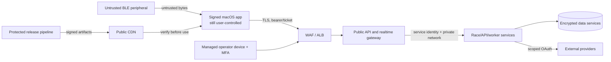

# Security, privacy, safety, and fair play

Status: Initial reference  
Owner: Security and product  
Last reviewed: 2026-09-12

## Security posture

VIR processes account data, social relationships, payment entitlement, device metadata, and fitness/heart-rate data. The macOS client and PM link are untrusted from the cloud's perspective. The design protects continuity and privacy while making bounded claims about competitive integrity; ordinary consumer BLE is not cryptographic proof of a Concept2 machine or a human rower.

Security, privacy, safety, and fair play are separate review axes. Passing one does not imply the others.

## Assets

Highest-value assets are:

- update signing keys, Apple Developer ID credentials, and release pipeline;
- identity-provider configuration and token validation keys;
- account identifiers, email mapping, privacy/consent history, and social graph;
- workout samples, heart rate, history, and private ghosts;
- third-party OAuth refresh tokens;
- billing webhooks and entitlement ledger;
- authoritative race inputs, results, sanctions, and audit log;
- operator accounts and support exports;
- service credentials, KMS keys, database backups, and production logs.

Raw PM serials are not valuable enough to justify cloud retention; use a keyed pseudonym. Card data stays in the hosted billing provider and must never reach VIR logs or databases.

## Trust boundaries

Each arrow is validated. TLS or code signing does not make payload semantics trustworthy.

## Threat model

| Threat | Example | Principal controls | Residual limit |
|---|---|---|---|
| Malicious BLE data | software peripheral or malformed characteristic | strict length/type/state parser, bounded allocation, fuzzing, capability matrix | cannot prove genuine PM hardware |
| Modified client | forged metrics, entitlement bypass, hidden automation | server authority, input consistency, version/risk policy, signed builds, replay audit | client can still fabricate plausible data |
| Replay | reuse race ticket/frame/webhook | short single-use ticket IDs, sequence/epoch/room binding, event ledgers | reconnect buffer needs bounded legitimate replay |
| Account takeover | token or email compromise | system browser PKCE, short access token, Keychain refresh token, IdP protections, reauth for linking/destructive action | compromised OS/user session remains powerful |
| Broken object authorization | reading another session/ghost | principal-scoped queries and policy checks, opaque IDs, negative authorization tests | operator roles require continued audit |
| API abuse | large upload, enumeration, socket flood | WAF, quotas, rate/size/time limits, streaming decode, backpressure, circuit breakers | volumetric attack may degrade online mode |
| Injection/deserialization | hostile JSON/Protobuf/FIT/content | generated decoders, bounds, parameterized SQL, no uploaded code execution, sandboxed workers | new libraries require review/fuzzing |
| Update compromise | malicious appcast/archive or stolen key | Developer ID + notarization + EdDSA archive/feed, isolated signing, two-person release, rollback/revocation plan | Apple and project trust roots remain dependencies |
| Supply-chain compromise | poisoned UE plug-in/Go module | pinned hashes, allow-list, SBOM, provenance, review, vulnerability response | Unreal/content toolchain is large |
| Insider/operator misuse | browse private fitness data or alter result | least privilege, masked-by-default UI, just-in-time elevation, immutable audit, alerts | authorized support access cannot be eliminated |
| Third-party token leak | Concept2 refresh token exposed | KMS envelope encryption, server-only use, scoped access, log redaction, disconnect/revoke | provider compromise outside VIR control |
| Cross-user social harm | stalking, abusive text/content | no free text/voice/UGC at launch, block/privacy controls, coarse presence | display names/emotes still need reporting path |
| Resource exhaustion | massive room fanout or crafted compression | room/client caps, decompression ratio limits, bounded queues, load shedding | very large public event needs separate planning |

Threat modeling is repeated for each major feature and after an incident, not filed once at project start.

## Client security

- Treat the packaged application as public and reversible. It contains public keys and public client identifiers, never API client secrets, database credentials, KMS material, billing secrets, or Concept2 OAuth secret.
- Store refresh tokens in macOS Keychain. Hold access/race tokens in memory and scrub references on logout/expiry as far as practical.
- Use the system browser for login/OAuth. Validate callback state, nonce, issuer, audience, redirect URI, and PKCE verifier.
- Require HTTPS with normal platform trust validation. Certificate pinning is not a launch default because emergency rotation and proxy accessibility costs outweigh its benefit; reconsider for high-stakes event builds.
- Compile Shipping builds without console/debug endpoints, development certificates, test service URLs, verbose packet logging, or `get-task-allow`.
- Hardened Runtime and library validation remain enabled. Every executable/library nested in the app is signed consistently and notarized.
- Request only Bluetooth and outgoing network access needed by the distribution channel. Do not request microphone, camera, contacts, location, broad filesystem, accessibility, or input-monitoring permission at launch.
- User-selected FIT/diagnostic export uses the standard save panel and writes only the chosen file.
- Verify signed content metadata, file hashes, size, compatibility, and safe path before mount. No downloaded native plug-in, Blueprint bytecode mod, dylib, or script execution.
- Redact tokens, emails, raw device serial, authorization headers, query parameters, and raw heart rate from logs by construction, with automated tests.

## Authentication and session management

- OIDC Authorization Code + PKCE; exact redirect URI allow-list.
- Validate JWT using cached issuer JWKS with bounded refresh, allowed algorithm list, `iss`, `aud`, `exp`, `nbf`, and subject.
- Map `(issuer, subject)` to an internal user; never trust mutable email as identity.
- Access tokens are short-lived (initially 10–15 minutes); refresh policy is managed centrally and revocable.
- Logout clears Keychain material, local user-scoped caches, and live sockets without deleting guest/local workout history accidentally.
- Account/linking, integration linking, billing changes, data export, and deletion require recent authentication.
- Race tickets contain room, role, user, client build, nonce/JTI, issued/expiry times, and allowed action. Gateway records JTI admission and rejects cross-room/audience reuse.
- Operator authentication uses a separate client/audience and group policy; consumer tokens cannot call admin APIs.

## Authorization model

Default deny. Policies evaluate principal, resource ownership/relationship, purpose, role, account state, block/privacy state, entitlement, and event membership.

Examples:

- A user can read a private session only if it belongs to them.
- A friend sees only the profile/presence fields allowed by the owner's privacy setting and block graph.
- A spectator ticket can receive allowed race state but cannot submit metrics or ready a participant.
- Support can view account/session metadata only after opening an audited case; dense samples/heart rate require separate elevated scope and recorded reason.
- Event adjudicators can append an adjudication revision for assigned events, not edit/remove the prior result.
- A worker can decrypt only integration tokens for the job/provider it is executing.

Authorization tests include owner, unrelated user, blocked user, expired entitlement, wrong room/role, stale revision, support without case, and service with wrong task role.

## API and network security

- TLS 1.2 minimum and TLS 1.3 preferred at public edge; modern cipher policy and HSTS for web properties.
- WAF managed rules plus explicit endpoint rate/size policies. Rate limits combine IP/network signals with authenticated principal and operation.
- REST mutation idempotency, WebSocket phase/message allow-lists, bounded Protobuf fields, and monotonic sequences.
- Stream uploads/downloads with deadlines. Enforce compressed and uncompressed limits before/while decoding; quarantine failures.
- Parameterized SQL only. Do not build object keys, redirects, callback URLs, or shell commands from unchecked input.
- Outbound provider clients allow-list HTTPS hosts, reject redirects to untrusted origins, set connection/request timeouts, cap responses, and use circuit breakers.
- Internal services use private discovery, least-privilege task roles, security groups, and mTLS for gateway-to-race streams. No public database/Redis endpoint.
- Production administrative endpoints are not hidden-but-public debug handlers. They live behind explicit operator authorization and audit.
- Error responses reveal stable category and trace ID, not stack, SQL, token, internal address, or vendor secret.

## Encryption and keys

| Data | Protection |
|---|---|
| Public traffic | TLS at edge; TLS/mTLS for sensitive internal hops |
| RDS/Redis/S3/SQS/logs/backups | service-managed encryption with environment-specific KMS keys |
| External OAuth tokens | per-record data key/envelope encryption; ciphertext, key version, provider metadata |
| macOS refresh token | Keychain |
| Local fitness payloads | AES-256-GCM per blob/chunk with per-profile Keychain key; owner-only files, FileVault encouraged |
| Update archives/feed | Developer ID/notarization plus separate EdDSA signing |
| Content manifest | offline signing key and embedded verification public key |
| Operator audit | append-only records and restricted retention store/export |

Separate production/non-production keys and accounts. Release/update keys are not present on ordinary developer laptops or general CI runners. Signing requires protected environment approval, produces a transparency record (source revision, dependencies, hashes, signer, notarization ID), and supports documented rotation.

Local encryption uses platform cryptographic primitives, fresh random nonces, authenticated associated identity/version data, and a key per local profile. Keychain key deletion is part of explicit local data deletion. It limits exposure from copied database/WAL files but is not claimed to resist malware or another process controlling an unlocked user account.

Secrets Manager stores service/provider secrets with automatic rotation where supported. Applications retrieve at runtime through task identity; secrets are never committed, baked into images, printed by CI, or passed on a command line that logs process arguments.

## Privacy model

### Data classes

| Class | Examples | Default visibility |
|---|---|---|
| Public/profile-selected | display name, avatar, country/club if chosen, published result | explicit profile/leaderboard choice |
| Account private | email mapping, IdP subject, locale, entitlement | user and narrowly scoped staff/services |
| Fitness sensitive | session samples, pace, power, stroke rate, intervals, heart rate, training zones | user only; explicit sharing/export |
| Device/technical | local peripheral ID, firmware, pseudonym, quality/errors | local/support; pseudonymized operations |
| Secret | refresh tokens, keys, webhook secret | dedicated service only |
| Audit/security | logins, sanctions, adjudication, operator access | security/authorized operations |

“Sensitive” is a product security category; legal classification is assessed per launch jurisdiction with counsel.

### Collection choices

- Guest solo mode requires no cloud account.
- Account essentials, social visibility, heart-rate storage, product analytics, crash diagnostics, public leaderboard, ghost sharing, Concept2 linking, and each later integration have distinct purposes/settings.
- Declining optional analytics or heart-rate cloud storage does not disable core rowing.
- Do not collect date of birth, sex, weight, precise location, contacts, camera, microphone, or free-text health notes at launch unless a later feature passes necessity review.
- Coarse country is optional profile decoration/match scheduling, not inferred precise location.
- The PM may report heart rate; the setting determines persistence/sync, and absent consent it is discarded after requested live display.

### Retention baseline

Final values require product/legal approval and publication before beta:

| Data | Initial engineering default |
|---|---|
| User workout summaries | until user deletion or account policy |
| Dense synchronized samples | 13 months, configurable/shortenable by user/product policy |
| Private/public ghosts | until source/visibility removal, then queued deletion |
| Operational client/service logs | 30 days hot, aggregate SLO data longer without direct identifiers |
| Security/operator audit | 12 months minimum unless legal policy requires another period |
| Raw consented support bundle | 30 days or case closure, whichever policy is shorter |
| Integration refresh token | until disconnect/revocation/account deletion |
| Idempotency records | bounded to maximum legitimate retry horizon |
| Deleted-account tombstone | minimal non-reversible abuse/billing evidence only if approved and required |

Lifecycle rules run automatically and are tested. Backups expire on a documented schedule; deletion responses explain backup isolation/expiry without pretending immediate bit erasure from immutable backups.

### Export and deletion

- Export contains human-readable JSON/CSV summaries, original supported session objects or FIT where applicable, profile/settings/consent/social/integration metadata, and a manifest with schema descriptions/checksums.
- Export download uses a short-lived single-purpose URL after recent authentication; generation/access are audited.
- Deletion immediately prevents new sign-in/use, revokes sessions and integrations, hides social/public data, cancels jobs where possible, then asynchronously removes/anonymizes owned data.
- Race records may retain a pseudonymized competition/audit result only under a published, reviewed rule. Public identity is removed unless retention has a valid stated reason.
- Every processor/integration has a deletion/retention mapping and contract owner.

Before launch, counsel/product must assess applicable privacy, consumer, subscription, child-safety, health-data, and cross-border rules for actual markets. This document is engineering design, not legal advice.

## Safety design

Indoor rowing is physical activity. Product behavior must reduce distraction and avoid false assurance:

- First run asks the user to place the Mac securely, route cables away from the rail/handle, verify clear space, and keep the PM visible/usable.
- Safety/stop controls are reachable by keyboard and mouse, but the product also explains that the athlete can stop rowing at any time; it never asks them to make a dangerous reach mid-stroke.
- A PM disconnect, stale metric, or app error produces a clear visual/audio state. The boat stops receiving official progress; the app never urges the user to pull harder to “repair” a sensor.
- Workout targets are ranges and cues, not punishment. User can pause/stop an ordinary workout. Race forfeiture rules are explicit but never lock the user into exercise.
- High heart rate is displayed as sensor data/zone only. The app does not diagnose an emergency or promise to detect one.
- Photosensitivity, motion, audio, color, and text-size settings are available before entering a world. Critical cues have redundant channels.
- Subscription expiry, update prompts, surveys, and integration failures never overlay active exertion.
- The app makes no promise of automatic resistance; manual damper guidance is educational and optional.
- Training content receives qualified coaching/product review and identifies intensity, prerequisites, recovery, and contraindication disclaimer without pretending individual medical advice.
- Incident reporting distinguishes software/data failure from a reported physical injury and routes each to the correct owner.

## Fair play and integrity

### Eligibility levels

| Label | Meaning |
|---|---|
| `Recorded` | a locally/cloud-saved workout, possibly offline or app-guided |
| `Live supported source` | permitted PM protocol and firmware were observed live with acceptable continuity |
| `Ranked eligible` | live source plus current client/ruleset, latency, quality, and integrity policy |
| `Provisional result` | race finished but durable commit/integrity processing incomplete |
| `Final result` | committed effective result revision |
| `Reviewed result` | an adjudicator appended a reasoned revision |

Avoid the word “verified” in UI unless a tooltip defines the exact level. None of these labels prove who sat on the rower.

### Controls

- Server accepts cumulative PM distance against a server-observed baseline and common start; it does not accept position.
- Validate sequence/time/distance continuity, state transitions, reconnects, source capability, build, and broad cross-metric consistency.
- Rules/thresholds are versioned, replayable, monitored for demographic bias, and broad enough to avoid encoding a narrow idea of human performance.
- Detection produces evidence codes and risk, not an unexplained permanent accusation.
- Obvious protocol violations reject frames immediately. Statistical anomalies generally make a result provisional/reviewed rather than altering valid local workout data.
- Sanctions require reason, evidence link, actor, expiry/scope, user notice where appropriate, and appeal workflow.
- Leaderboard removal does not delete the athlete's private workout unless separately requested/policy-required.
- Prize/elite events use a separate threat model and supervised event controls.

## Operator security

- SSO and phishing-resistant MFA; managed devices where feasible.
- Roles: support, event operator, integrity reviewer, privacy operator, billing support, security admin. No universal day-to-day role.
- Just-in-time elevation and two-person approval for account deletion override, result adjudication at high-stakes events, signing, key rotation, and bulk export.
- Search results minimize fields and mask sensitive values. Accessing session samples or heart rate requires case ID and reason.
- All read/write access to sensitive views and every mutation emits an append-only audit event with actor, reason, target, before/after digest, timestamp, and trace.
- No direct production database console for ordinary support. Emergency access is time-bound, recorded, alerted, and reviewed.

## Secure delivery gates

Every release requires:

- reviewed threat-model delta and data-field/permission delta;
- dependency lock verification, license inventory, SBOM, secret scan, SAST, and vulnerability policy;
- unit/property/fuzz tests for PM and network parsers;
- authorization/integration abuse tests and rate/size boundary tests;
- signed provenance linking source commit, generated contracts, content, and binaries;
- Shipping build inspection for debug symbols/endpoints/secrets/entitlements;
- Apple code-sign, Hardened Runtime, notarization, Gatekeeper, clean-install, upgrade, and rollback evidence;
- update/content signature negative tests;
- privacy export/deletion test in staging;
- on-call owner, dashboards, runbooks, rollback and kill switches.

Critical exploitable findings block release. Exceptions have named owner, affected assets, compensating control, expiry, and executive/security approval.

## Incident response priorities

1. Protect athlete safety and stop harmful guidance/content.
2. Protect the release channel and credentials; if signing/update compromise is possible, halt appcast/content rollout first.
3. Contain unauthorized data access and revoke affected identity/integration/service sessions.
4. Preserve forensically useful, access-controlled logs without expanding personal-data exposure.
5. Keep offline rowing available when safe, while disabling affected online feature through signed configuration.
6. Communicate factually; do not label local workouts invalid because an unrelated cloud service failed.
7. Meet jurisdiction/provider notification obligations through the approved legal process.
8. Restore from known-good artifacts, rotate keys in the documented order, verify, and publish a post-incident review.

Dedicated runbooks are required for stolen Developer ID/update key, malicious content manifest, IdP compromise, external OAuth token exposure, database exfiltration, abusive operator, result-integrity attack, billing-webhook forgery, and regional outage.
