# Delivery and operations

Status: Initial reference  
Owner: Platform and release engineering  
Last reviewed: 2026-09-12

## Delivery principles

- A release is the application, content set, contracts, PM capability matrix, cloud deployment, migrations, configuration, and runbooks—not just an Unreal binary.
- Pin and fingerprint the complete toolchain. Updates enter through an explicit compatibility pull request.
- Build once per channel promotion. Do not rebuild different bytes for stable after beta approval.
- All production changes have review, provenance, observable rollout, rollback/disable path, and an owner.
- Client/content compatibility supports a gradual rollout and at least one safe prior stable application during the published update window.
- No backend deployment may make a currently active local workout impossible to finish.

## Source control

Use Git with Git LFS for Unreal binary assets. Protect `main`, require short-lived branches, reviewed pull requests, passing checks, signed or organization-verified commits where available, and linear/reviewable history. Do not commit generated Unreal caches/build outputs or any Epic engine source/binaries to this product repository.

Suggested ownership:

```text
Source/RowingCore, Contracts/        client + online domain reviewers
Plugins/Concept2PM/                 device owner plus client reviewer
Content/, Source/RowingWorld/       content/graphics owner
Services/                            online owner
Infra/                              platform/security owner
Build/, Config/                     release owner
docs/adr/, security-sensitive docs  architecture/security CODEOWNERS
```

Binary assets receive normal review through Unreal metadata validation, generated thumbnails/diffs where possible, and performance/license provenance—not a blanket exemption because Git cannot display them.

## Pinned build manifest

`Config/BuildVersions.json` becomes the machine-readable source for:

- app semantic version and monotonic `CFBundleVersion`;
- Unreal version, patch/changelist, and engine installation fingerprint;
- macOS SDK, Xcode, clang, and minimum deployment version;
- Protobuf compiler/runtime and API contract versions;
- Go version, module lock digest, container base image digest;
- Sparkle exact version and minimum security baseline;
- PM protocol-spec digest and capability-profile version;
- SQLite/Zstandard/FIT and other native dependency versions;
- content schema, ruleset schema, and minimum compatible sets.

The application exposes a sanitized version report from Settings. Cloud logs the compatible versions but never trusts the client report for authorization without server policy.

## Developer environments

### macOS client workstation

- macOS Tahoe 26.6.2 or a separately approved newer patch.
- Xcode 26.1.1 selected with `xcode-select`; automatic App Store updates disabled on golden builders.
- Stock Unreal Engine 5.8 approved patch, native Apple silicon.
- CMake/Ninja only for engine-independent libraries/tests if it materially improves test speed; UnrealBuildTool remains authoritative for packaged modules.
- Git LFS, pinned Protobuf tools, formatting/linting, and sanitizers supported by the engine/toolchain.
- No production secrets or release signing identity on ordinary developer machines.

### Engine policy

Begin with an unmodified stock Epic engine. A golden pre-provisioned engine installation is fingerprinted on Mac builders. If a source build is required for automation or a proven defect, build an internal installed engine through BuildGraph and record its upstream commit/patch series; do not fork casually. Every engine modification requires an ADR, isolated patch, upstream-tracking owner, and upgrade test.

### Local online stack

Provide a versioned local composition for PostgreSQL, Redis-compatible cache, queue emulator where useful, object storage emulator, control API, gateway, worker, and race worker. Fixtures create deterministic users, routes, plans, rooms, and race replays. External providers are represented by contract stubs; shared staging is not a requirement for ordinary tests.

## Environments

| Environment | Cloud isolation | Data | External providers | Purpose |
|---|---|---|---|---|
| Local | developer machine | synthetic | stubs | fast development |
| CI | ephemeral per run where possible | generated | stubs | repeatable checks |
| Development | non-prod AWS account | synthetic | provider sandboxes; Concept2 dev server | integration |
| Staging | non-prod AWS account, production-shaped | synthetic/consented test accounts only | provider sandboxes/dev | release candidate, load, DR rehearsal |
| Production | dedicated AWS account | real | approved live applications | customers |

No production database is copied to non-production. If a bug truly requires representative structure, generate or irreversibly synthesize a bounded fixture through an approved process.

## Continuous integration

### Pull-request pipeline

Run in parallel where dependencies permit:

1. Repository policy, generated-file consistency, secret scan, license allow-list, dependency lock and SBOM diff.
2. C++ format/static analysis plus engine-independent unit/property/parser tests with sanitizers where compatible.
3. Go format/vet/static analysis, unit/race tests, migration lint, API authorization tests.
4. Protobuf/OpenAPI lint, breaking-change check, deterministic generation, cross-language serialization tests.
5. UnrealBuildTool Development Editor compile on Apple silicon.
6. Headless Unreal automation for data assets, route validators, Blueprint compile, redirectors, and cook references.
7. Terraform format/validate/security policy and plan for non-production.
8. Container build by digest, vulnerability scan, non-root/runtime policy test.
9. Documentation link/diagram lint and ADR/reference checks.

### Main/nightly pipeline

- Shipping client compile/cook/package without signing.
- Deterministic representative content cook and manifest/hash comparison.
- Full PM parser corpus, fuzz budget, simulator scenarios, and race replay corpus.
- Multi-process local online test with fault injection and duplicate delivery.
- Unreal performance capture on representative scenes.
- Packaged clean-user smoke test, SQLite migration/recovery matrix, and update-from-last-stable rehearsal.
- Hardware-in-loop PM5 tests on a scheduled Mac/rower rig.
- Dependency/vulnerability refresh and expiring-certificate/key alert.

### Release-candidate pipeline

This pipeline, including all signing/notarization/Sparkle steps below, is required starting Phase 4; per [ADR-0008](../adr/0008-defer-macos-signing-to-phase-4.md), Phase 0–3 release candidates stop at step 4 (unsigned build/cook/stage plus SBOM/provenance) and distribute the unsigned artifact directly.

1. Resolve an immutable source revision, build manifest, dependency locks, and approved content set.
2. Build/test on a clean, ephemeral Apple-silicon runner whose engine/toolchain fingerprint matches the manifest.
3. Compile, cook, and stage the Shipping app with Unreal Automation Tool/BuildGraph.
4. Generate SBOM, symbol bundle, contract/capability copies, and provenance statement.
5. Sign nested frameworks/helpers from the inside out and the final app with Developer ID under Hardened Runtime.
6. Verify designated requirements, entitlements, absence of `get-task-allow`, library signatures, and bundle contents.
7. Create the distribution DMG, submit with `notarytool`, fail on warnings requiring action, staple the ticket, and verify with Gatekeeper on a clean machine.
8. Sign the Sparkle archive/appcast with the separate EdDSA key; require signed feed and verification-before-extraction where supported by the approved version.
9. Upload immutable artifacts to a quarantine prefix, verify download hashes, then atomically publish the channel manifest.
10. Deploy compatible cloud/container/database changes progressively and run production synthetic checks before widening client/content rollout.

Release signing is a protected job with two-person approval. Secrets are delivered through the CI secret store to an ephemeral Keychain/stdin-supported tooling and erased after the job. Commands and logs must not echo secret material.

## macOS packaging and channels

Initial direct distribution uses a notarized Developer ID DMG and Sparkle 2, starting Phase 4 (ADR-0008). This avoids making Mac App Store review/sandbox/billing constraints a launch dependency while retaining Gatekeeper trust. Before Phase 4, the `internal`/`alpha`/`beta` channels below distribute the unsigned ad-hoc build directly, with manual reinstall in place of Sparkle-managed updates.

Channels:

- `internal`: employees/test rigs, rapid expiry, verbose diagnostics allowed only with test data.
- `alpha`: invited device matrix, no production-ranked results.
- `beta`: production services with beta namespace/eligibility and staged percentage.
- `stable`: general availability.

Each channel has its own signed feed URL and update policy. A stable install never accepts a lower-trust channel feed through a user-editable URL. Downgrades require a deliberately signed recovery release; Sparkle delta/full fallback and last-known-good complete DMG are retained.

The approved Sparkle release is pinned and monitored because older versions have had security fixes. Developer ID/notarization and EdDSA feed/archive checks are both required. See [distribution research](../archive/research/2026-09-12-product-and-integrations.md) and [ADR-0006](../adr/0006-macos-distribution.md).

## Application/content/cloud compatibility

The signed catalog exposes:

```text
client_build
protocol_major/minor
supported_control_api_range
supported_realtime_range
content_schema_range
ruleset_schema_range
pm_capability_profile_version
minimum_safe_client_build
recommended_client_build
```

- Control API supports current and previous released client contract through the stated upgrade window.
- A race pins an exact compatible client policy, real-time protocol, ruleset, route metadata, and content set.
- Content downloads can proceed in the background, but activation occurs only outside a session.
- `minimum_safe_client_build` is used only for security/correctness issues and blocks starting affected online modes, not access to local history/export.
- The client always retains its last-known-good compatible content and a built-in minimal route.
- Server feature flags default off for unknown clients and may disable new session entry. They do not rewrite active session rules.

## Content pipeline

```mermaid
flowchart LR
    Source[Reviewed Unreal assets\n+ license metadata] --> Validate[Editor validation]
    Validate --> Cook[Deterministic cook]
    Cook --> Perf[Automated scene/perf tests]
    Perf --> Pack[Versioned IoStore/Pak chunks]
    Pack --> Hash[Hashes + SBOM/content inventory]
    Hash --> Sign[Offline manifest signature]
    Sign --> Stage[CDN quarantine]
    Stage --> Canary[Internal/canary]
    Canary --> Stable[Stable catalog]
```



Validation includes route geometry and length, asset references, shader/texture/mesh/audio budgets, localization, unsafe flashing/audio thresholds, third-party license/source, content rating, and client schema compatibility. The pipeline refuses writable/executable native content.

Roll back by moving the signed catalog pointer to a previously approved immutable set. Never overwrite bytes at an existing content URL/hash.

## Database and contract changes

Use expand/migrate/contract:

1. Add backward-compatible schema/index with bounded lock behavior.
2. Deploy code that can read old/new and writes the chosen transitional form.
3. Backfill in throttled, restartable, observable batches.
4. Switch reads through a reviewed flag after verification.
5. Remove old code/schema only after the oldest supported client/server and rollback window expire.

Production migrations run as a dedicated one-shot task, never implicitly from every API replica. The pipeline captures plan/lock/estimated time, takes a verified recovery point, and stops rather than waiting indefinitely on a lock.

Protobuf fields are never renumbered or reused; removed fields are reserved. OpenAPI breaking checks require a new version or migration path.

## Cloud deployment

- Container images are multi-stage, minimal, non-root, read-only filesystem where possible, and referenced by digest.
- ECS services have readiness separate from liveness, graceful drain, connection-aware gateway shutdown, and deployment circuit breaker.
- Control API canary shifts a small traffic percentage before full rollout.
- Gateways stop accepting new WSS connections, notify/drain ordinary presence, and keep existing race streams until a bounded deadline.
- Race workers stop receiving new rooms and drain active rooms. An emergency security rollout may recover/cancel under the room policy.
- Terraform plans are reviewed; production apply is protected and logged. Manual console drift is detected and eliminated.
- Configuration is typed, validated at startup, environment-specific, and non-secret. Secrets are references resolved at runtime.

## Feature flags and kill switches

Flags have owner, purpose, creation/expiry date, target rules, safe default, and removal issue. Security/safety-critical remote configuration is signed or retrieved over authenticated control APIs and cached with expiry.

Required kill switches can prevent **new**:

- managed PM programming for an affected firmware profile;
- ranked races or a specific ruleset/content version;
- external integration exports;
- checkout/subscription changes;
- content/app update publication;
- social presence.

An ordinary flag never stops an active physical workout. If continuing is unsafe or corrupting, the client explains the fault, preserves the journal, and ends the affected online/managed mode explicitly.

## SLO and error-budget operation

Monthly launch SLOs:

| Service journey | SLI | Objective |
|---|---|---:|
| Local session | crash-free started workouts | 99.8% at GA |
| Control plane | good authorized requests / valid requests | 99.9% |
| Match entry | ready users allocated/admitted within target | 99.5% |
| Active race socket | non-client-fault connected race time | 99.9% |
| Result finalization | committed within 60 s | 99.9% |
| Session sync | accepted within 5 min when service reachable | 99.5% |

Measure planned maintenance separately but report it transparently. If an SLO exhausts its error budget, pause risky feature rollout and prioritize reliability. Do not redefine “valid” traffic after an incident to improve a chart.

## Operational runbooks

Every alert links to a versioned runbook containing impact, dashboard/query, safe diagnostic commands, containment, rollback/failover, customer communication trigger, escalation, and verification.

Minimum runbooks:

- control API elevated errors/latency;
- PostgreSQL saturation/failover/restore;
- Redis eviction/failover and room lease behavior;
- SQS backlog/DLQ redrive;
- realtime gateway disconnect storm;
- race tick overrun or worker loss;
- clock-offset breach;
- result finalization/reconciliation stuck;
- bad PM firmware capability rule;
- corrupt/unsafe content withdrawal;
- app update/notarization/signature failure;
- Concept2/billing/identity-provider outage;
- data export/deletion stuck;
- credential/signing key compromise;
- regional outage.

## Backup and recovery exercises

- Daily automated backup status is necessary but insufficient.
- Quarterly restore RDS plus required S3/config into an isolated account, run integrity queries, and exercise application reads.
- Monthly restore a random sample object/content artifact and verify its digest.
- Quarterly simulate Redis loss; durable summaries/results must remain correct.
- Quarterly replay a race-worker failure and gateway drain under load.
- Twice yearly exercise region-loss decision/communications and rebuild production from Terraform/backups.
- Record measured RPO/RTO, gaps, owners, and remediation; untested objectives are labeled aspirational.

## Cost controls

Tag every resource by environment/service/owner. Set budget anomaly alerts, S3 lifecycle, log sampling/retention, Fargate right-sizing, database/storage forecasts, and per-feature cost dashboards. The race path tracks cost per concurrent rower-hour; integration tracks cost per completed export; content tracks egress/cache hit rate.

Cost controls load-shed optional analytics and non-urgent jobs before workout sync, room admission, or result durability. Financial pressure is never handled by silently dropping user workouts.
