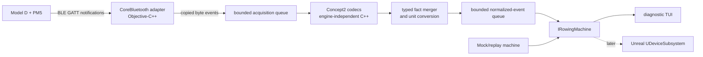

# Delivery Phase 0 diagnostic architecture and ownership

Status: Planned  
Owner: A0 — CTO / Principal Architect  
Last reviewed: 2026-09-13

## Architecture

The proof of concept is a native macOS diagnostic application. It validates the production-shaped device boundary without depending on Unreal, a renderer, persistence, or a network service.



The TUI and later Unreal client consume the same public rowing-machine interface. Neither is permitted to import CoreBluetooth types, Concept2 characteristic IDs, raw packet layouts, or Objective-C objects.

## Component responsibilities

| Component | Responsibility | Must not own |
|---|---|---|
| `RowingCore` | Units, normalized telemetry, quality flags, and hardware-neutral rowing state | BLE, Concept2 packet layouts, terminal behavior, Unreal types |
| `RowingDevice` | Discovery/session interfaces, ordered events, lifecycle semantics | Platform APIs, packet parsing, product UI |
| `Concept2PMCore` | Published Concept2 UUID manifest, byte codecs, typed PM facts, capability evaluation, fact merging | CoreBluetooth callbacks, terminal drawing, gameplay |
| `Concept2PMMac` | CoreBluetooth adapter, permission state, scanning, GATT lifecycle, copied byte delivery | Field interpretation above basic framing and characteristic routing |
| `pm5-tui` | User-driven scan/select/connect/disconnect and ephemeral display | Protocol decisions, telemetry derivation, persistence |
| `pm5-sim` | Deterministic public-interface scenarios for tests and development | Production protocol behavior not established by fixtures or specification |
| Test suites | Parser, contract, simulator, integration, and HIL assertions | Hidden product policy or implementation-only exceptions |

## Proposed directory layout

```text
Build/                                  orchestration and future packaging definitions
Config/
  BuildVersions.json                   pinned and observed toolchain versions
  PM5Capabilities.json                 evidence-approved exact device profiles
Scripts/                               stable local and CI entry points
Source/
  RowingCore/                           hardware- and engine-independent domain types
  RowingDevice/                         hardware-neutral device contracts
Plugins/Concept2PM/
  Source/Concept2PMCore/                pure C++ codecs, facts, merger, capability rules
  Source/Concept2PMMac/                 Objective-C++ CoreBluetooth adapter
  Source/Concept2PMUnreal/              descriptor/smoke wrapper only in this milestone
  Tests/                                Concept2 parser and adapter tests
Tools/
  pm5-tui/                              diagnostic application bundle
  pm5-sim/                              mock/replay implementation
Tests/
  Contract/                             public-interface invariants
  Integration/                         simulator/TUI integration tests
  Fixtures/PM5/                         sanitized, reviewed non-production fixtures
docs/phase-0/                                diagnostic architecture, plans, and evidence
VirtualRowing.uproject                  empty Unreal toolchain smoke host
```

Unreal-generated `Binaries/`, `DerivedDataCache/`, `Intermediate/`, and `Saved/` directories and local evidence artifacts must be ignored. No Unreal content assets are required in this milestone.

## Dependency rules

Dependencies point inward toward `RowingCore` and the public contracts:

```text
pm5-tui ───────────────┐
Concept2PMMac → Concept2PMCore → RowingDevice → RowingCore
pm5-sim ────────────────────────→ RowingDevice → RowingCore
Concept2PMUnreal ───────────────→ RowingDevice → RowingCore
```

- `RowingCore` depends only on the C++ standard library subset approved by the pinned Unreal toolchain.
- `RowingDevice` may depend on `RowingCore`; the reverse dependency is forbidden.
- `Concept2PMCore` may depend on both core modules; neither core module may import it.
- `Concept2PMMac` is the only module allowed to import CoreBluetooth or Foundation device APIs.
- `pm5-tui`, the simulator, and the future Unreal wrapper are replaceable consumers/adapters.
- A platform or vendor type crossing into a public header is a release-blocking architecture defect.
- Build metadata must preserve these boundaries as separate targets rather than compiling everything into one undifferentiated executable.

## Development capability profile

`Config/PM5Capabilities.json` is a reviewed, versioned development allow-list; it is not a remote feature flag. One entry matches the observed tuple below and declares the decoder surface already present in the signed build.

| Profile field | Purpose |
|---|---|
| Monitor model, hardware revision, firmware revision, and machine kind | Exact identity and supported configuration |
| Required and optional characteristics/properties | Subscription and readiness contract |
| Allowed packet lengths and implemented fields | Decoder bounds and telemetry interpretation |
| Requested status rate and stale thresholds | Observable liveness policy |
| Profile version, source-spec digest, evidence reference, and approval date | Reproducibility and review trail |

The profile may disable an optional characteristic or tighten a previously approved entry. It may not add an unimplemented decoder, relax a bounds check, or turn an unreviewed tuple into `Allowed`. Any such change requires the contract checkpoint and updated automated and hardware evidence.

## Thread and queue model

CoreBluetooth delegates run on one dedicated serial dispatch queue. Delegate payload bytes are copied before callback return and then placed on a bounded acquisition queue. Decoding, validation, merging, and unit conversion run on a worker outside both the CoreBluetooth queue and the TUI thread.

Normalized events cross a second bounded queue to a single consumer. Diagnostic Milestone 1 uses a capacity of 512 ordered events. The implementation must expose queue depth and overflow as diagnostics. It must not silently drop connection, fault, stroke/state, or other non-coalescable events.

The public API is non-blocking:

- commands report only whether they were accepted for processing;
- completion and failure arrive as ordered events;
- one owner controls a discovery or machine instance;
- one consumer polls each event stream;
- shutdown waits for adapter cancellation and prevents callbacks into destroyed consumers.

Any later change to multiple consumers, callbacks, coroutine/future ownership, or queue topology requires A0 review because it affects the Unreal integration contract.

## Ownership boundaries

| Area | Primary owner | Review requirement |
|---|---|---|
| `docs/architecture`, `docs/adr`, `docs/phase-0` | A0 | A8 for merge readiness |
| Public `RowingCore` and `RowingDevice` headers | A0 contract authority; A2 implementation | A0 approval for every public change |
| `Plugins/Concept2PM` and PM parser fixtures | A1 | A0 for contract changes; A8 integration review |
| `Tools/pm5-tui` | A1 for these diagnostic-only milestones | A8; no product UI behavior |
| `RowingCore` telemetry validation helpers | A2 | A0 contract review; must remain vendor-neutral |
| `Tools/pm5-sim`, contract/integration scenarios | A6 | A8; A1 reviews claims about PM5 behavior |
| `Build`, toolchain configuration, scripts, CI, root build metadata | A7 | A0 for dependency changes; A8 merge review |
| Future Unreal gameplay/client modules | A3/A4 as assigned later | Out of scope now |

An owner may add private implementation details inside its boundary. It may not change another owner's public contract, build target, fixture meaning, or evidence claim without coordination.

## Integration checkpoints

1. **A0 contract checkpoint:** public types, units, state names, event ordering, target names, and capability schema are approved before parallel implementation begins.
2. **Native compile checkpoint:** real and simulated adapters compile against the same interfaces; core tests run without Unreal or CoreBluetooth runtime access.
3. **Simulator checkpoint:** the TUI completes all lifecycle scenarios through the simulator before real hardware is required.
4. **Identity checkpoint:** the real PM5 identity tuple is observed and redacted; A0/A1 approve an exact development capability entry before `Ready` is allowed.
5. **Hardware checkpoint:** live telemetry, stale detection, disconnect/reconnect, and the 6-minute run pass.
6. **Integration gate:** A8 checks dependency direction, privacy, deterministic evidence, and absence of product-feature scope creep.

## Principal risks

| Risk | Early signal | Milestone 1 response | Owner |
|---|---|---|---|
| Accepted Xcode/Unreal versions unavailable or incompatible | Doctor or smoke build fails | Keep installed versions side by side; do not relax ADR pins without evidence and an ADR review | A7/A0 |
| PM5 firmware/layout differs from documentation | Unexpected properties, length, or enum | Fail closed, record redacted tuple/metadata, add no guessed decoder | A1 |
| CoreBluetooth permission identity is unstable for a CLI | Repeated prompts or denied callbacks | Use an app bundle with usage description and stable development signature | A1/A7 |
| Notification gaps or queue pressure hide state | Stale timer, depth, or overflow events | Surface degradation immediately; tune only from recorded aggregate evidence | A1/A6 |
| Simulator is cleaner than hardware | HIL behavior has no matching scenario | Add a deterministic minimized scenario without copying sensitive raw data | A6/A1 |
| Diagnostic code becomes a parallel product architecture | TUI accumulates session/game rules | Delete or keep it strictly as a replaceable tool consuming public contracts | A0/A8 |
| No persisted raw capture reduces reproducibility | Hardware-only parser defect cannot be replayed | Use published-spec fixtures and redacted aggregate evidence; reconsider capture only with explicit approval | A0/A1/A6 |
